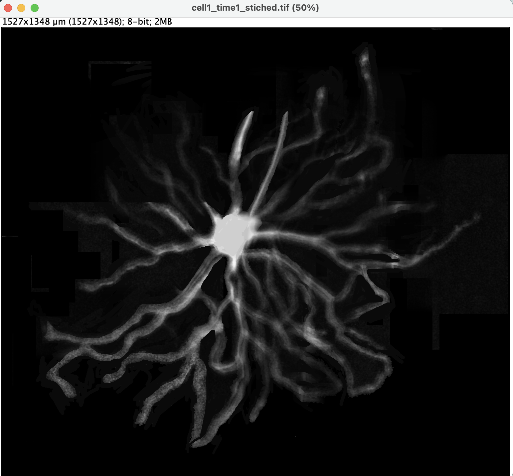
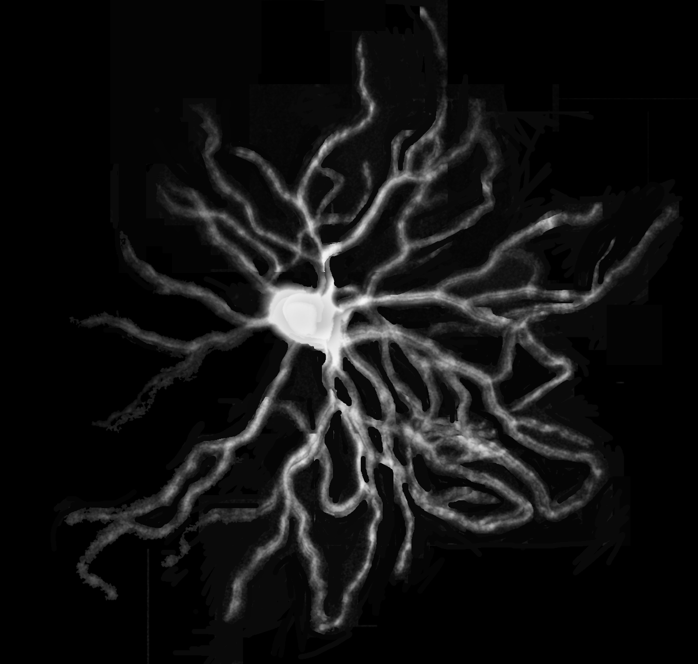
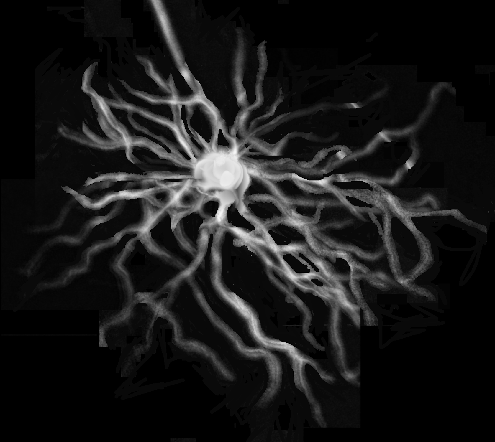
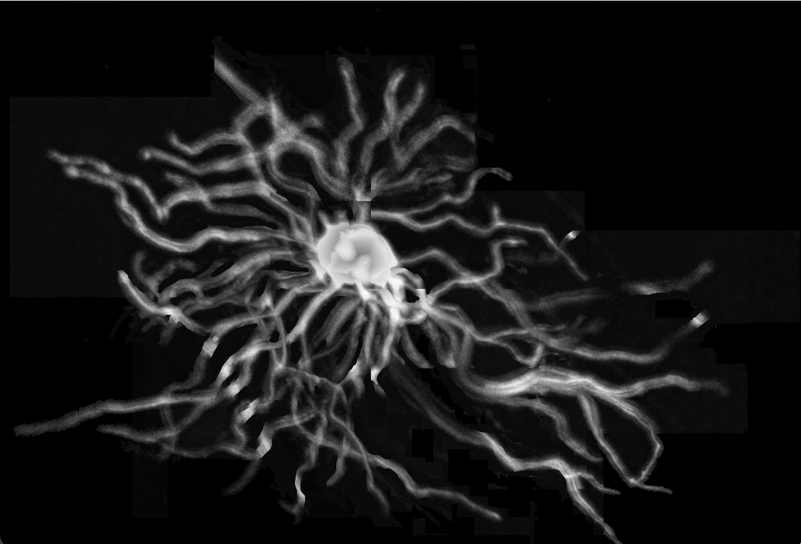
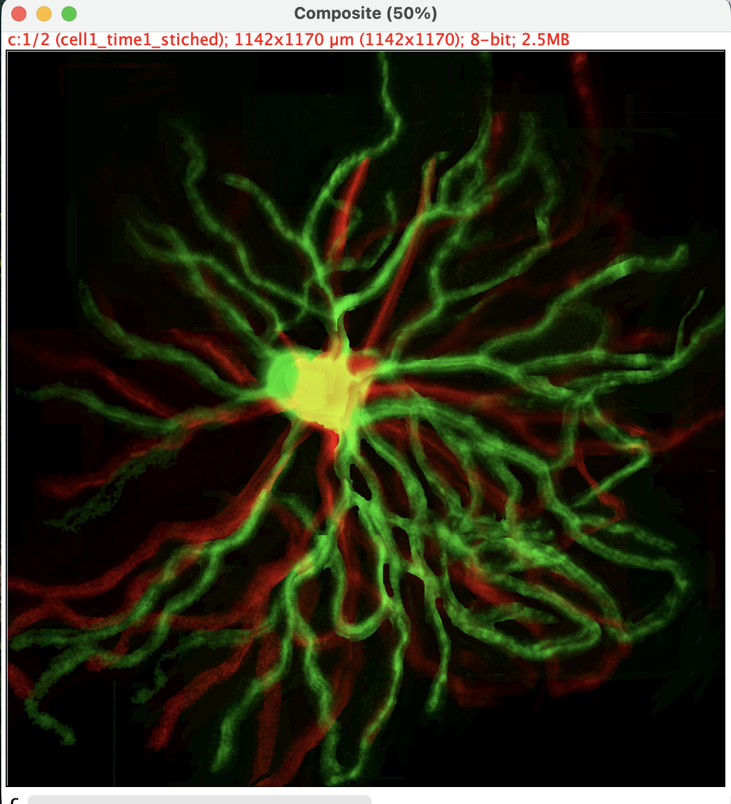
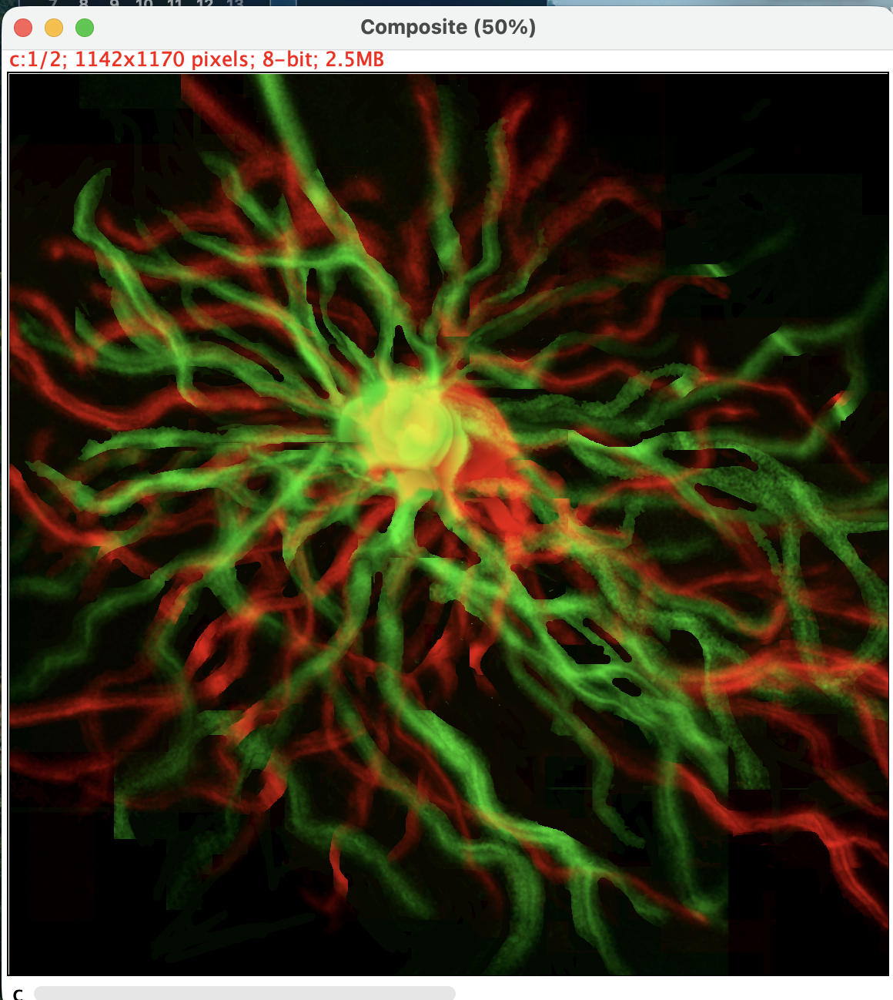

# Neuron Morphology Analysis: Standard Operating Procedure
Prepared by: Anuva Nabiha
Date: 6/12/2026

# Purpose
This SOP describes detailed steps for processing and analysing longitudinal in vivo fluorescence images of 2 individual neurons at 2 times using Fiji/ImageJ software. It covers preprocessing, stitching, neurite tracing, temporal comparison, and false positive/false negative assessment. (Optionally 3D reconstruction)

# Final output 
Please use this google drive link to find the original output folder:
Screenshots of steps is added in the repository under `imagej_output_screenshots' for quick navigation. 

# Assignment Methodology

Detailed steps of each phase is written in here, with output files in the `outputs` folder. An example walkthrough of steps with screenshots will be added in the output folders' markdown file. 

## Raw data set 
Dataset     |  # Tiles   |  Tile size  | dtype 
CELL1_TIME1 |     15     |  480×624 px | uint8
CELL1_TIME2 |     16     |  480×624 px | uint8
CELL2_TIME1 |     23     |  480×624 px | uint8
CELL2_TIME2 | 36 + 2 AVI |  480×624 px | uint8

## Step 1: Image Prepocessing & Optimization 
The goal of this step is to remove any uneven background, boost contrast, reduce nouse, and isolate the target cells from any neighboring cells.

The raw dataset has 2 AVI files (bs_011 and bs_013 files within CELL2_TIME2) which needs additional steps before processing:
* `File` -> `Import` -> `AVI...` → select the AVI file
* Leave `Use Virtual Stack` unchecked
* Check `Convert to Grayscale`
* `Image` -> `Stacks` -> `Z Project...`:
    1. Set `Start slice` = 1 & `Stop slice` = 744 (default for that AVI file)
    2. Set `Projection Type` to `Average Intensity`
    3. Click OK
    _Notes/rationale: The stacks are auto-filled by Fiji to cover the entire stack. A  average intensity projection type will average across all ~744 frames and reveal the underlying structure out of the per-frame noise_
* Rescale: `Image` -> `Adjust` -> `Brightness/Contrast...`
* `File` -> `Save As` -> `Tiff.`

Now, all files are ready for processing. 

1. Confirm Imagetype: Open each tile at a time to confirm they are grayscale images 624x480 px and 8-bit type; If this is not default image type can be found: `image` ->  `Type` 
2. Background Subtraction: This will remove uneven glow that is visible. Follow these steps:
    * `Process` -> `Subtarct Background`
    * Set `Rolling Ball Radius` = 50.0 pixels
    * Uncheck `Light background` 
    * Check `Sliding paraboloid`
    * Click `OK`

    _Notes/rationale: We are using 50px as the tiles are 480×624px and neurites are thin (~3-5 px wide). Therefore a radius of 50px can capture the background without affecting the actual signal. Light background is uncheked as the images are grayscale fluorescence. Finally, sliding paraboloid will give more accurate correction on curved background._
3. Contrast Enhancement (CLAHE): Instead of uisng the standard 'Enhance Contrast`, CLAHE adjusts to local regions which is better for neurons with soma and distal neurites. 
    * `Process` -> `Enhance Local Contrast (CLAHE)`
    * Set `Blocksize` = 63
    * Set `Histogram bins` = 256
    * Set `Maximum slope` = 1.5
    * Leave Mask as `*None*`, leave `Fast` checked
    * Click `OK`

    _Notes/rationale: A blocksize of 63 px is set as 63px is the size CLAHE uses to compute its local histogram. our tiles are 624×480px and individual neurites are ~3–5 px wide. A blocksize of 63px is ~10% of the tile width, large enough to capture meaningful local contrast around a dendritic branch while small enough to adapt between the bright soma and distal tips. Histogram bins of 256 is left (default) as it matches the full uint8 range of images, fewer bins would lose intensity resolution. Maximum slope is the contrast amplification limit per tile block. As the images are already dim, a slope of 1.5 enhances signal without over-amplifying background noise._
4. Denoise:
    * `Process` -> `Filters` -> `Gaussian Blur...`
        - `Sigma` = 1.0
        - Click OK

        _Notes/rationale: Gaussian blur reduces continuous shot noise. Sigma controls the blur radius. At 1.0 px, the blur kernel is narrow enough that it only averages over ~3 px, which smooths out single-pixel shot noise without visibly blurring neurite edges._
    * `Process` -> `Filters` -> `Median...`
        - `Radius` = 1
        - Click OK

        _Notes/rationale: Median filter replaces each pixel with the median of its neighbors in a 3×3 window (radius 1 = 1 px out from centre). This specifically targets isolated hot pixels and salt-and-pepper noise that Gaussian blur softens but does not fully remove. Radius 1 is the minimum effective setting as a radius of 2 was stating to erode the dentritic tips._
5. Separate Neighboring Cells: 
    * Duplicate the image first: `Image` -> `Duplicate` -> name it **separate_neighbor** -> OK
    * On this duplicate image, run: `Image` -> `Adjust` -> `Threshold...` In the threshold GUI:
        - Method dropdown: select `Otsu` (instead of `Default`)
        - Select `B&W` in the color dropdown
        - Check `Dark background`
        - Check `Dont Reset Range`
        - Click Apply. The image should become black and white

    _Notes/rationale: Otsu's method automatically finds the threshold by minimizing the variance within the two classes_
    * `Process` -> `Binary` -> `Watershed` — this separates touching blobs
    _Notes: This is optional depending on the image we are processing as oversegemntation may disrupt ROI manager to pickup all the regions_
6. Analyze: `Analyze` -> `Analyze Particles...`
    * `Size`: 500-Infinity (in pixels²) 
    * `Circularity`: 0.00 - 1.00 
    * Show: `Bare Outlines`?
    * Check `Add to Manager`
    * Check `Include holes`
    * Click OK

    _Notes/rationale: 500-Infinity pixels² sets the minimum area a connected region must have to be counted as a real object. 500 px² corresponds to a circle of roughly 25 px diameter, which is larger than any noise speck or single hot pixel but smaller than the soma. Setting circularity ranges from 0 (infinitely elongated) to 1 (perfect circle) means we accept all shapes: the soma is roughly circular (~0.7–1.0) but dendritic branches are very elongated (~0.0–0.2)._
7. ROI Manager: The ROI Manager opens with numbered regions. Looking at the original image, we can now identify which ROI is the target cell. The largest continuous region is our cell. 
    * In the ROI Manager: click on any ROI that is a neighbor cell
    * On the original image (not the duplicate): go to `Edit` -> `Clear`; this fills that region with black (zero)
    * Close the **separate_neighbor** duplicate 
8. Save the original file under `outputs` > `step1_processed`
### The outputs for this step can be found in `outputs` > `step1_processed`

## Step 2: Image Stiching
The goal for this step is to combine all processed tiles for each cell and timepoint into a single wide-field image of the whole cell.

I renamed the processed files to match the file type of tile_{ii}.tif format for this step. For example, `ch2_20260310_bs_024_20260312_strip_ref001_001.tif` is now `tile_024.tif`.
Grid/Collection Stitching (which computes a global optimization across all tiles at once) was tried first. For this dataset it produced a scattered, disconnected result. Therefore, I decided to use Pairwise Stitching where I iteratively ran one new tile at a time, only ever comparing the new tile against the immediately-preceding result. The steps are as follows:
1. Open the first two tiles in bs order (e.g. c1t1tile_24.tif and c1t1tile_25.tif)
2. `Plugins` -> `Stitching` -> `Pairwise Stitching`
3. In the pop-up GUI, confirm:
    * First image (reference): c1t1tile_24.tif
    * Second image (to register): c1t1tile_25.tif
    * Click OK
4. Next, in the Pairwise Stiching GUI:
    * `Fusion Method`: `Max. Intensity`
    * Change the name of the output file if desired 
    * Keep `Check Peaks` between 1-5
    * Check `Subpixel accuracy`
    * Depending on the images we can either:
        - use `Compute overlap`
        - Or pick x and y coordinates for fusing the images. 
_Notes/rationale: Max Intensity is used as at each overlapping pixel, the brighter of the two tiles' values is kept, rather than averaged. Subpixel accuracy helps avoids 1px jumps/visible seams at tile boundaries when fusing thin structures_
5. Continue until every tile for this dataset has been added. We completed cell reconstruction for all four data sets. 
### The outputs for this step is saved in `outputs` > `step2_stiched`

Cell 1 @T=1, stiched:

Cell 1 @T=2, stiched:

Cell 2 @T=1, stiched:

Cell 2 @T=2, stiched:

## Step 3: Axon vs. Dendrite Separation, Labeling & Tracking
The goal of this step is to trace every neurite process, label the axon vs. dendrites, and track changes between T1 and T2.

1. Setup & Soma Identification:
    * Open a stiched cell
    * Open the ROI Manager: `Analyze` -> `Tools` -> `ROI Manager`
    Select the Oval Selection Tool, draw a circle around the central soma, press T to add it to the manager, click it, and rename it to soma.
2. Trace the Axon:
    * Right-click the Line Tool and select the Segmented Line Tool.
    * Locate the single longest, thinnest, least-branched process exiting the soma (the axon).
    * Click along its path from the soma boundary to its furthest distal tip. Double-click to complete the line.
    * Press T to add it to the ROI Manager. Rename it exactly to axon.
3. Trace the Dendrites:
    * Use the Segmented Line Tool to trace each dendritic branch. Start from the soma boundary (or parent branch point) and click along the path to the tip. Double-click to finish.
    * Press T after each trace. Label them sequentially: dendrite_01, dendrite_02, dendrite_03, etc.
4. Configure & Measure Lengths:
    * Go to `Analyze` -> `Set Measurements...` and ensure Perimeters and area are checked. 
    * In the ROI Manager, select all ROIs  and click Measure (on the Fiji/ImageJ GUI). 
    * In the Results window, go to `File` ➔ `Save As...` and save the file to the workspace under outputs/step3_traced/..
5. Export Labeled Visualization Overlay:
    * In the ROI Manager, highlight the axon ROI, click `Properties...`, and change its Stroke Color to blue.
    * Highlight all dendrites ROIs, click `Properties...`, and set their Stroke Color to red.
    * Go to `Image` -> `Overlay` -> `Flatten`. This creates a new RGB display window
    * Save this window in outputs/step3_traced/..
6. Save the Vector ROIs:
    * In the ROI Manager, select all items and click More ➔ Save....
    * Save the file.
_Do these sreps for all four cell datasets_

### The outputs for this step is saved in `outputs` > `step3_traced`

## Step 4: T1  T2 Superimposed

1. Manual Alignment:
    * Open both cell1_time1_stitched.tif and cell1_time2_stitched.tif.
    * Find the coordinates of the center of the soma in both images using the cursor.
    * Subtract the coordinates to find the translation offset ($\Delta x$, $\Delta y$).

2. Click on the Time 2 image, go to `Image` -> `Transform` -> `Translate...`, 
    * Enter calculated offsets, and save the resulting file: cell1_time2_aligned.tif

3. Generate the Color Composite: 
This step requires the two images to be the same dimentions. If the images are not of the same dimentions, we crop them to match length and width. Then we can create color composits for both cells. 
- Go to `Image` -> `Color` -> `Merge Channels...`
- Set C1 (Red) = cell1_time2_aligned.tif
- Set C2 (Green) = cell1_time1_stitched.tif
- Check `Create Composite` and click OK. 
- Save the result

Cell 1 Composite:

Cell 2 Composite:

### The outputs for this step is saved in `outputs` > `step4_superimposed`

## Step 5: False Positives and False Negatives

1. Manually calculate False Positives and False Negatives:
Zoom in close  and scan along the traced paths from the soma outward to the dendritic 

* Confirmed True Positives (TP)
    - Look at a line we traced and check the raw image underneath it. If there is a clear, visible fluorescent neurite path under the line, that is a True Positive.
    - This will typically be the vast majority of the traces. If we traced 45 total branches and almost all of them perfectly match real structures, the TP count will be close to that total
* False Positives (FP)
    - Look for any traced line in the overlay that is passing over pure black background or a faint blur that doesn't look like a real cell process. This happens if background noise or an artifact looked like a dendrite while we were clicking quickly.
    - Every time we find a line we drew that has no real structure underneath it on the raw image, add $1$ to the FP count. 
* False Negatives (FN)
    - Look closely at the raw image for real, branching fluorescent processes or very dim distal tips that do not have a colored tracing line on top of them.
    - Every time we spot a genuine biological neurite branch that we completely missed or forgot to trace, add $1$ to the FN count.

2. Use the prepared python file, `analysis.py` to finish calculation and visualize results 

# References
* https://sbalzarini-lab.org/?q=downloads/imageJ 
* https://imagej.net/plugins/clahe 
* https://imagej.net/ij/docs/guide/146-29.html
* https://imagej.net/ij/docs/menus/process.html
* https://imagej.net/imaging/particle-analysis
* https://imagej.net/scripting/batch 
* https://pubmed.ncbi.nlm.nih.gov/19346324/ 
